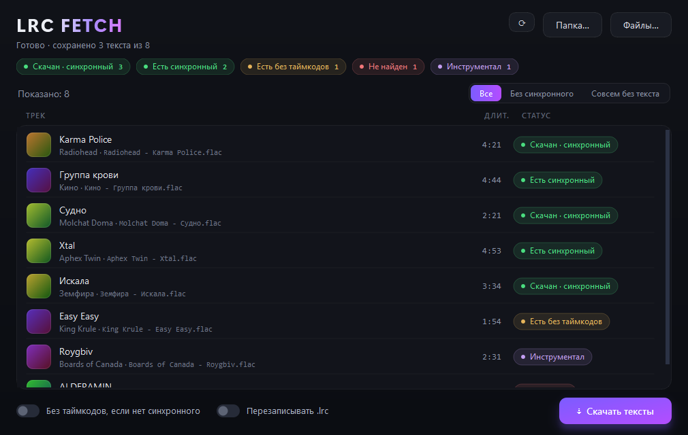

<div align="center">

# LRC Fetch

**Массовая загрузка синхронных текстов песен для локальной музыкальной библиотеки.**

Укажи папку — приложение просканирует её, найдёт `.lrc` с таймкодами
и разложит рядом с треками. Для караоке-плееров, HiBy/FiiO, foobar и всего,
что умеет показывать синхронный текст.




</div>

## Возможности

- **Два источника из коробки** — [lrclib.net](https://lrclib.net/) и NetEase
  Cloud Music. Если в первом текста нет, автоматически проверяется второй.
- **Приоритет синхронного текста** — сначала ищется `.lrc` с таймкодами; plain
  берётся только как запасной вариант (настраивается).
- **Проверка совпадения** — кандидат принимается, только если сходятся название,
  исполнитель и длительность (±5 с). Чужая версия песни не подсунется.
- **Умная нормализация запроса** — мусор из тегов (`(Official Video)`,
  `Remastered 2011`, `feat.`) вычищается, а маркеры версии (`Live`, `Acoustic`,
  `Remix`) сохраняются: у них свой текст и тайминг.
- **Видно состояние сразу** — при сканировании каждый трек помечается «есть
  синхронный / есть без таймкодов / нет текста», ещё до скачивания.
- **Фильтр и клик по статусам** — покажи только то, что без текста или, скажем,
  только «Не найден», и качай прицельно именно эту группу.
- **Ручной выбор варианта** — если на трек несколько версий, открой список,
  сравни длительность и начало текста и выбери нужную.
- **Апгрейд plain → synced** — уже лежащий текст без таймкодов будет заменён,
  если синхронный найдётся; готовый синхронный не трогается.
- **Быстро и вежливо** — треки обрабатываются параллельно, с оценкой
  оставшегося времени и аккуратным лимитом запросов к источникам.

## Установка

Скачай готовый **`LRC Fetch.exe`** из раздела
[**Releases**](../../releases) — портативный, установка не нужна: запустил
и работаешь.

<details>
<summary>Запуск из исходников</summary>

```bash
pip install -r requirements.txt
python app.py        # с консолью
pythonw app.py       # без консоли
```

</details>

## Как пользоваться

1. Нажми **«Папка…»** (или перетащи папку/файлы в окно). Сканирование
   рекурсивное; поддерживаются mp3, flac, m4a, ogg, opus, wma, wav, aiff, ape,
   wv, dsf и другие.
2. Метаданные берутся из тегов, а при их отсутствии — из имени файла вида
   `Исполнитель - Название`.
3. Нажми **«Скачать тексты»**. Рядом с каждым треком появится `<то же имя>.lrc`
   в UTF-8.

Фильтр над списком (**Все / Без синхронного / Совсем без текста**) и клик по
плашкам-статусам ограничивают и показ, и последующее скачивание — удобно
догонять только недостающее. Правый клик по треку → **«Выбрать вариант…»**
для ручного выбора версии.

## Статусы

| Статус | Значение |
|---|---|
| Есть синхронный | Рядом уже лежит `.lrc` с таймкодами |
| Есть без таймкодов | Рядом уже лежит `.lrc` без таймкодов |
| Нет текста | Файла `.lrc` нет |
| Скачан · синхронный | Найден и сохранён текст с таймкодами |
| Скачан · без таймкодов | Найден только plain-текст, сохранён |
| Не найден | Ни в одном источнике ничего подходящего |
| Инструментал | Трек помечен как инструментальный |

## Сборка exe

```bash
pip install pyinstaller
python -m PyInstaller --noconfirm --clean --onefile --windowed ^
    --name "LRC Fetch" --icon lrcfetch.ico ^
    --add-data "lrcfetch.ico;." --collect-submodules mutagen app.py
```

Результат — `dist/LRC Fetch.exe`.

## Разработка

Структура: `app.py` — окно и фоновые воркеры, `widgets.py` — кастомные виджеты,
`core.py` — сканирование/теги/запись `.lrc`, `normalize.py` — чистка запросов,
`candidate_dialog.py` — окно ручного выбора, `providers/` — источники текстов
(`base.py` — общий контракт и проверка совпадения). Новый источник добавляется
одним файлом в `providers/` и строкой в реестре.

Тесты (без сети):

```bash
python test_normalize.py
python test_providers.py
python test_scan.py
python test_client.py
python test_eta.py
```

## Лицензия

[MIT](LICENSE)
